# Provider Dues Collection: Solution Design

**Program:** Provider Annual Dues Modernization (Salesforce Payments / Pay Now)
**Initial market:** Texas CIN
**Status:** Draft for review
**Date:** 10 September 2026
**Source inputs:** Provider Dues PRD (v. 8/3), five solution diagrams (business flow, system architecture, ERD, logical processing flow, notification & payment lifecycle) and the engineering low-level design diagram.

---

## 0. How to read this document

| If you are… | Read |
|---|---|
| Executive sponsor / business owner | §1 Executive summary, §2 Scope, **Part A** (High-Level Design), §D.1 (email answer in plain English), Part I (delivery plan) |
| Product / operations | Part A, Part F (new markets), Part G (reporting), Part J (open questions) |
| Salesforce architect / developer | Part B (architecture + data model), **Part C** (low-level design), Part E (Pay Now review), Part H (test strategy) |
| Release / admin | §C.7 feature flags, §C.10 retention, Part F, Part J verification checklist |

Two design principles govern every decision below:

> **P1: The obligation is the source of truth.** The Dues Obligation record (today drawn as `Annual_Account_Dues__c`) is the single record that states what an account owes, whether it is paid, and what was sent to them. Roster files and provider-level assessments are *inputs* that can be replayed or purged; the obligation is not.

> **P2: Configuration over code.** Anything that differs between markets, years, price points, invoice cadences, or notification rules lives in Custom Metadata Types (CMDT) and cycle records, not in Apex, not in Flow decision elements. Adding market #2 must require **zero lines of new code**.

---

## 1. Executive summary

Network Services collects annual dues from providers in the Texas CIN. Today the process is manual: invoices are produced outside Salesforce, providers can only pay by check, payment status is invisible in Salesforce, and in 2024 **17% ($172k) of dues went uncollected**.

This design replaces that with an automated pipeline inside Salesforce:

1. **A roster file arrives** from the upstream data team (DDG or equivalent) and lands in a staging object. It may contain duplicate rows, and a corrected file may follow an hour or two later.
2. **A daily scheduled job** picks the *latest complete* file, resolves each row to a real provider and a real billing account, removes duplicates using NPI + TIN as the business key, and writes one clean **assessment** per provider.
3. **Assessments roll up to one obligation per account per cycle.** An account with 12 providers at $215 gets **one** obligation for $2,580, not 12 invoices.
4. **A batch job generates a Salesforce Pay Now payment link** for each obligation and stores the URL on the obligation record.
5. **Scheduled notifications** email the billing contact with the amount, due date and secure payment link, on the approved reminder calendar. Every send re-checks that the obligation is still unpaid.
6. **The provider pays** on the Salesforce-hosted Pay Now page. Salesforce Payments writes the result to the Payment Intent and Payment records; a subscriber correlates that back to the obligation, marks it Paid, cancels every unsent reminder, and queues a receipt.
7. **Nightly reconciliation** catches anything that fell between the cracks and raises an actionable exception instead of failing silently.

Everything above is driven by configuration records. A second market with different pricing, a different invoice cadence and a different reminder calendar is onboarded by adding metadata rows, not by writing code.

### The three answers the team asked for up front

| Question | Answer | Detail |
|---|---|---|
| **Can Salesforce email 10K accounts today?** | Yes, but only by spreading the send across days and throttling it. Salesforce caps the **whole org** at **5,000 external email recipients per day**. | Part D |
| **Can Salesforce email 100K accounts in future?** | **No.** 100,000 ÷ 5,000/day = 20 days. Core Salesforce email is structurally unable to do it at any volume like that. | §D.2 |
| **So what do we build?** | A **channel abstraction**: the dispatcher writes to an interface, and a CMDT value selects the implementation, Salesforce email for MVP, Marketing Cloud Next or an external ESP later. Switching channels is a config change, not a rebuild. | §D.4, §C.7 |

---

## 2. Scope, assumptions and constraints

### 2.1 In scope (MVP)

- Roster ingestion from an upstream-loaded object (bulk-safe, duplicate-tolerant, latest-file-wins).
- Provider identity resolution against Health Cloud (NPI → provider, TIN → account).
- Provider-level assessment and account-level obligation with an auditable, reproducible roll-up.
- Pay Now payment link generation at 10K+ record scale.
- Configurable notification engine supporting both fixed-calendar (annual) and relative-offset (monthly) schedules, with production on/off switches.
- Payment settlement correlation from Payment Intent back to the obligation.
- Reconciliation, exception handling, retention/purge.
- MVP reports and dashboard.

### 2.2 Out of scope (MVP)

- Termination execution (stays manual, outside Salesforce, per PRD).
- Refunds (PRD: not currently issued).
- Marketing Cloud implementation (designed for, not built in MVP).
- Proration engine (manual adjustment path only).

### 2.3 Assumptions

| # | Assumption | Impact if wrong |
|---|---|---|
| A1 | The upstream team can supply a **file/batch identifier** on every roster row (or a file header record). | Without it, "latest file" cannot be determined reliably; see §C.1.3 for the fallback and its weaknesses. |
| A2 | Salesforce Payments (Pay Now) is licensed and the Experience Cloud data channel is configured. | Blocks the whole payment path. |
| A3 | The bill-to account holds, or can resolve to, a billing email address. | Notification cannot be addressed; row becomes an exception. |
| A4 | Roster volume: ~10K provider rows, single-digit thousands of bill-to accounts, ≤ 200K rows in a worst-case future market. | Above ~1M rows/year, revisit LDV design (§C.13). |
| A5 | Providers are billed once per cycle per account; a provider appearing under two TINs produces two assessments on two obligations (this is correct, not a duplicate). | Changes the dedup key. |

### 2.4 Hard constraints

- **PCI:** no card number, CVV, expiry or bank account number in any Salesforce record or log. Only status, reference, amount, timestamp.
- **Retention:** payment and communication history retained ≥ 5 years (PRD 4.2). This **conflicts** with the requested 1-year purge of assessments, resolved in §C.10.
- **Email:** 5,000 external recipients per org per day (Part D).
- **No code deploy to change operational behaviour in production**, all switches in CMDT.

---

# PART A: HIGH-LEVEL DESIGN (business view)

## A.1 The journey, end to end

```mermaid
flowchart LR
  subgraph LOAD["1 · LOAD"]
    A1["Upstream team loads<br/>roster file<br/>(NPI, TIN, amount, year)"]
    A2["Daily job picks the<br/>latest complete file"]
    A3["Match each row to a<br/>provider and a billing account"]
  end
  subgraph BILL["2 · BILL"]
    B1["Remove duplicate rows<br/>NPI + TIN is the key"]
    B2["One assessment<br/>per provider"]
    B3["Add them up per account<br/>= one obligation"]
    B4["Approve &amp; freeze<br/>the amount"]
  end
  subgraph NOTIFY["3 · NOTIFY"]
    C1["Generate secure<br/>Pay Now link"]
    C2["Email the billing contact<br/>on the reminder calendar"]
    C3["Every send re-checks:<br/>still unpaid?"]
  end
  subgraph COLLECT["4 · COLLECT &amp; CLOSE"]
    D1["Provider pays on the<br/>Salesforce hosted page"]
    D2["Obligation marked Paid,<br/>reminders cancelled,<br/>receipt sent"]
    D3["Unpaid after final notice<br/>→ termination review task"]
  end
  LOAD --> BILL --> NOTIFY --> COLLECT
```

## A.2 Who does what

| Actor / system | Responsibility |
|---|---|
| **Upstream data team (DDG)** | Delivers the roster file into the staging object. Owns file completeness and the control total. |
| **Network Services (business ops)** | Configures the cycle (dues year, due date), reviews exceptions, approves the bill run, works the delinquency and termination queues. |
| **Salesforce Health Cloud** | The master record for provider identity (NPI), facility/TIN relationships, and the billing account. Dues never invent provider data. |
| **Dues Automation (what we build)** | Everything between the roster file and a paid obligation: resolution, dedup, roll-up, links, notices, settlement, reconciliation, retention. |
| **Salesforce Payments / Pay Now** | Hosted checkout, tokenisation, payment result. No card data ever reaches our objects. |
| **Notification channel** | Salesforce email in MVP; Marketing Cloud Next or an ESP later. Selected by configuration. |
| **Provider / group billing contact** | Receives one consolidated notice per account and pays online (or by check, which ops records manually). |

## A.3 Worked example: what the business actually sees

**Account:** North Texas Family Medicine (TIN 75-1234567), 12 providers.
**Roster file:** contains 14 rows for that TIN, 12 unique NPIs, plus 2 rows that repeat NPIs already listed (a known quirk of the source extract).

| Step | What happens | Result |
|---|---|---|
| Ingest | All 14 rows are stored exactly as received. Nothing is rejected at load time. | 14 staging rows |
| Resolve | Each NPI is matched to a Health Cloud provider; the TIN is matched to the billing account. | 14 resolved rows |
| Dedup | The 2 repeated NPIs carry the same amount as their originals, so they collapse. | **12 assessments** |
| Roll-up | 12 × $215 | **1 obligation = $2,580** |
| Link | One Pay Now link for $2,580 | URL stored on the obligation |
| Notify | One email to the billing contact, with amount, due date, link, newsletter PDF | Notice logged |
| Pay | Contact pays $2,580 by card or ACH | Obligation = Paid, reminders cancelled, receipt sent |

If one of those repeated rows had carried a **different amount** ($215 vs $250), the pipeline would **not guess**. It raises an exception, excludes that provider from the obligation, and shows it in the exception queue for business correction. **No obligation is ever published from a file that does not balance.**

## A.4 What "framework" means in business terms

Everything that varies between markets is a setting an admin edits, not code a developer rewrites:

- which record types of Account are billable in this market,
- the price per provider (and per-TIN exceptions),
- whether billing is annual or monthly,
- the reminder calendar (fixed dates or "X days after invoice"),
- which notices are switched on,
- which email channel is used,
- how long roster data is kept.

Onboarding a second market is a configuration exercise measured in hours, not a project measured in months (Part F shows exactly which records change).

---

# PART B: SOLUTION ARCHITECTURE

## B.1 Component map

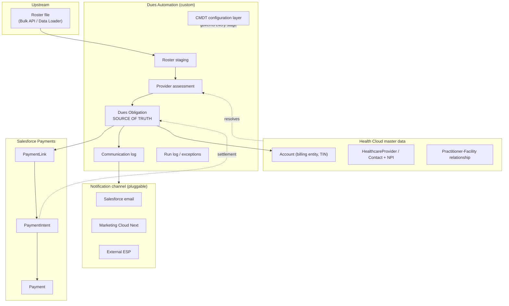

## B.2 Data model

### B.2.1 Object inventory

| Object (proposed API name) | Diagram name | Purpose | Volume/yr | Retention |
|---|---|---|---|---|
| `Dues_Roster_File__c` | `Roster_Import__c` | File/batch header: source id, received time, row count, control total, status | ~50 | 5 yr (header only) |
| `Dues_Roster_Row__c` | (staging) | Raw roster row exactly as delivered. **No uniqueness, no trigger.** | 10K-200K | **1 yr** (§C.10) |
| `Dues_Assessment__c` | `Provider_Dues_Assessment__c` | One deduplicated, resolved charge per provider per cycle | 10K | **1 yr + archive** |
| `Dues_Obligation__c` | `Annual_Account_Dues__c` | The account-level amount owed. **Source of truth.** | 2K-5K | 5 yr+ |
| `Dues_Cycle__c` | `Billing_Program_Cycle__c` | Market + period: dues year, invoice date, due date, freeze/approval state | ~5 | 5 yr+ |
| `Dues_Communication__c` | same | One row per planned/sent notice | 15K-25K | 5 yr |
| `Dues_Run_Log__c` | n/a | Job telemetry: stage, counts, errors, restart point | ~2K | 1 yr |
| `Dues_Exception__c` *(optional, phase 2)* | n/a | Ops queue for unresolved rows | varies | 1 yr |

> **Decision D-01: rename `Annual_Account_Dues__c` → `Dues_Obligation__c` (and `Provider_Dues_Assessment__c` → `Dues_Assessment__c`) before the first deployment.** The PRD already requires **monthly invoices** with a Net-30 relative schedule. An object called "Annual Account Dues" will be carrying monthly obligations within a year, and API names are extremely painful to change once reports, flows, permission sets, integrations and five years of data reference them. The label can stay "Annual Account Dues" for the Texas CIN users. *If the team prefers to keep the existing names, everything else in this design still holds, only the names change.*

### B.2.2 Entity relationships

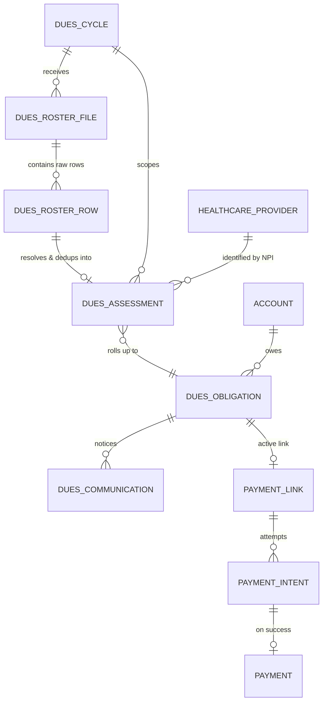

### B.2.3 The four keys that make the pipeline safe

Every stage is idempotent because of a deterministic key. Re-running any job produces the same result; it never double-charges, double-links or double-emails.

| Key | Field | Composition | Enforced by |
|---|---|---|---|
| **RowKey** | `Dues_Roster_Row__c.Row_Key__c` | `SourceFileId + SourceRowNumber` | External Id, **not unique** (see below) |
| **AssessmentKey** | `Dues_Assessment__c.Assessment_Key__c` | `CycleId + Market + normNPI + normTIN` | External Id, **Unique** |
| **ObligationKey** | `Dues_Obligation__c.Obligation_Key__c` | `CycleId + AccountId + CurrencyIsoCode` | External Id, **Unique** |
| **MessageKey** | `Dues_Communication__c.Message_Key__c` | `ObligationId + NoticeType + ScheduleVersion` | External Id, **Unique** |

> **Why RowKey is not unique:** the roster is *ingested as delivered*. A unique constraint at the staging layer would cause the upstream bulk load to fail on duplicate rows, exactly the failure mode we must avoid, because a failed load is worse than a duplicate row. **Deduplication happens on the way from staging into assessments, where we control the transaction.** This directly satisfies the requirement: *"we should not use NPI/TIN as unique because whatever fields we get, we need to ingest into Salesforce; after that we calculate."*

### B.2.4 Key fields on `Dues_Obligation__c`

| Field | Type | Notes |
|---|---|---|
| `Obligation_Key__c` | Text(255) ExtId **Unique** | Idempotency anchor |
| `Account__c` | Lookup(Account) | Bill-to |
| `Dues_Cycle__c` | Lookup(`Dues_Cycle__c`) | Market + period |
| `Market_Code__c` | Text | Denormalised from cycle for reporting/selectivity |
| `Provider_Count__c` | Number | Count of contributing assessments |
| `Amount_Due__c` | Currency(16,2) | **Frozen at approval** |
| `Amount_Calculated_At__c` | DateTime | Audit of last recompute |
| `Calculation_Hash__c` | Text | Hash of contributing assessment keys + amounts; proves the total matches the roster |
| `Due_Date__c` | Date | From cycle or relative rule |
| `Lifecycle_Status__c` | Picklist | Draft / Approved / Published / Closed / Cancelled |
| `Payment_Status__c` | Picklist | Unpaid / Partially Paid / Paid / Written Off |
| `Payment_Link_URL__c` | URL (**FLS-restricted**) | Bearer secret; see §C.14 |
| `Payment_Link_Ref__c` | Text ExtId | PaymentLink record id |
| `Payment_Link_Status__c` | Picklist | Pending / Active / Failed / Expired / Deactivated |
| `Link_Attempts__c` / `Link_Error__c` | Number / LongText | Retry + dead-letter support |
| `Payment_Intent_Ref__c` | Text ExtId | Correlation target (§C.8) |
| `Payment_Reference__c`, `Paid_Date__c`, `Amount_Paid__c` | Text/Date/Currency | Non-PCI settlement facts |
| `Payment_Method_Type__c` | Picklist | Card / ACH / Check (offline) |
| `Days_Overdue__c` | Formula | Aging reports |
| `Notice_Status__c` | Picklist | Not Started / In Progress / Final Sent / Escalated |
| `Is_Frozen__c` | Checkbox | Blocks recompute after publication |

## B.3 The configuration layer: this is the framework

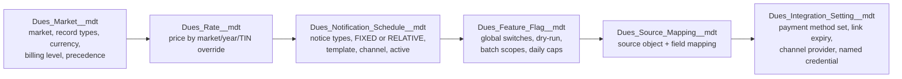

| CMDT | Controls | Example rows |
|---|---|---|
| `Dues_Market__mdt` | Market code, label, active flag, eligible Account record types, billing level (ACCOUNT / PROVIDER), currency, duplicate-resolution strategy, precedence rank, aggregation rounding | `TX_CIN` |
| `Dues_Rate__mdt` | Default amount per provider, effective year range, optional TIN override, amount precedence (file > TIN override > market default) | `TX_CIN_2027 = 215.00` |
| `Dues_Notification_Schedule__mdt` | Per market **and** invoice type: notice type, calculation method (`FIXED_DATE` \| `RELATIVE_TO_DUE` \| `RELATIVE_TO_INVOICE`), offset days or fixed MM-DD, email template, org-wide sender, channel, sequence, `Active__c`, `Suppress_If_Paid__c` | 5 rows for annual, 5 for monthly |
| `Dues_Feature_Flag__mdt` | `Master_Kill_Switch__c`, `Notifications_Enabled__c`, `Link_Generation_Enabled__c`, `Purge_Enabled__c`, `Dry_Run__c`, `Daily_Email_Cap__c`, per-stage `Batch_Scope__c`, `Ingest_Quiet_Period_Minutes__c` | 1 row per market + 1 global |
| `Dues_Source_Mapping__mdt` | Source object API name and field-to-field mapping for the roster feed | `DDG_Roster__c` → staging |
| `Dues_Integration_Setting__mdt` | Payment method set id, link expiry days, notification channel implementation class, named credential, retry limits | 1 per market |

> **Operational promise:** turning notifications off in production is *edit one CMDT checkbox → save*. No deployment, no code review, no release window. Every job reads the flags at the start of every run, and every dispatcher re-reads them immediately before sending.
>
> Custom Metadata records are editable directly in production (unlike Custom Settings' code coupling or hardcoded constants) and are still deployable/version-controlled as metadata, which is why they are the right home for these switches. Grant edit rights via a dedicated permission set, and record changes in the Setup Audit Trail.

## B.4 The daily pipeline

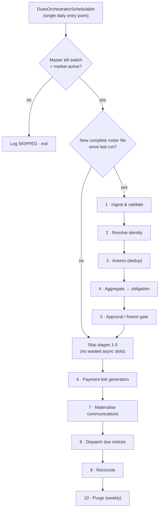

> **Important nuance on "don't run if there's no file":** the *roster* stages (1-5) skip when no new file arrived. Stages **6-9 always run**, because payment links, reminders, settlements and reconciliation must continue every day regardless of whether a roster file landed. Skipping them would stop reminders and delay payment posting.

**Why one orchestrator instead of eight scheduled jobs:** ordering is guaranteed, there is a single place to disable everything, only one entry in Scheduled Jobs to monitor, and the org's 100-scheduled-job limit is untouched as markets are added.

---

# PART C: LOW-LEVEL DESIGN (engineering)

## C.0 Component/class inventory

| Class | Type | Responsibility |
|---|---|---|
| `DuesOrchestratorSchedulable` | Schedulable | Daily entry point; flags, run log, stage chaining |
| `DuesConfig` | Service (cached) | Single accessor for all CMDT; no CMDT SOQL anywhere else |
| `DuesRosterFileSelector` | Selector | Latest-complete-file selection + supersede marking |
| `DuesIngestBatch` | Batch | Normalise raw rows, schema validation, control totals |
| `DuesResolutionBatch` | Batch | Bulk NPI/TIN → provider/account resolution |
| `DuesAssessmentBatch` | Batch | Deduplicate and upsert assessments |
| `DuesAggregationBatch` | Batch | Recompute obligations from assessments |
| `DuesPaymentLinkBatch` | Batch (AllowsCallouts) | Generate Pay Now links via `IPaymentLinkProvider` |
| `IPaymentLinkProvider` / `PayNowLinkProvider` / `MockLinkProvider` | Interface + impls | Isolates the managed action so it is testable and swappable |
| `DuesCommunicationMaterializer` | Batch | Create Planned notice rows from CMDT schedule |
| `DuesCommunicationDispatcher` | Batch | Claim due notices, re-check guards, send via channel |
| `IDuesNotificationChannel` / `SalesforceEmailChannel` / `MarketingCloudNextChannel` / `ExternalEspChannel` | Interface + impls | Pluggable send mechanism (Part D) |
| `DuesSettlementService` | Service (invocable) | Correlate payment → obligation, mark Paid, cancel notices, queue receipt |
| `DuesReconciliationBatch` | Batch | Nightly integrity sweep + exception creation |
| `DuesRetentionBatch` | Batch | Archive-then-purge per CMDT retention |
| `DuesRunLogger` | Service | Structured run/stage logging, restart points |
| `DuesExceptionService` | Service | Uniform exception creation + ops task generation |

## C.1 Stage 1: Ingestion and latest-file selection

### C.1.1 The load itself must not be slowed down

The roster is loaded by another team via Bulk API 2.0 / Data Loader.

**Rules:**
- `Dues_Roster_Row__c` has **no Apex trigger, no process, no flow, no roll-up summary, no validation rule that queries**. Load throughput is protected absolutely. All processing is deferred to the scheduled batch.
- Only exception: an optional, minimal, **CMDT-bypassable** after-insert trigger that upserts the `Dues_Roster_File__c` header (one query + one upsert per batch of 200, never per row). If the upstream team can create the header themselves, even this is removed.
- No required fields beyond the raw columns; no cross-object formula fields on the staging object (they slow saves and break selectivity).
- Fields are wide/text at ingest (`NPI_Raw__c`, `TIN_Raw__c`, `Amount_Raw__c`) so a malformed value **stores** rather than **rejects**. Normalisation happens in stage 1 processing, where a bad value becomes a reportable exception instead of a load failure.

### C.1.2 Choosing the latest file

Requirement: *"once roster file insert, later 1 or 2 hours they may create a new file, so we need to pick the latest one."*

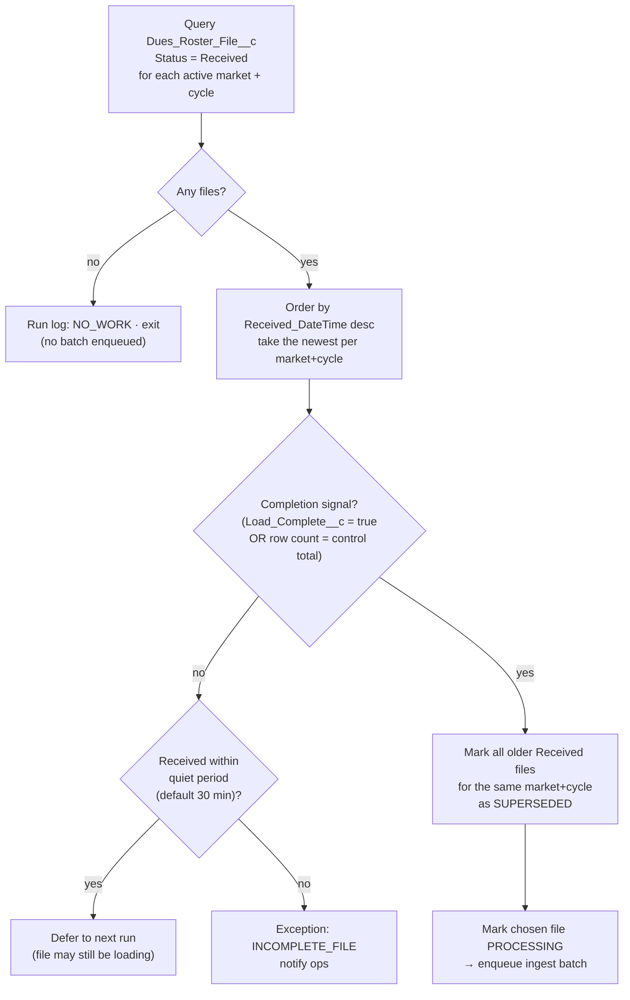

**Why the quiet period matters:** a 200K-row Bulk API load takes minutes. If the daily job fires mid-load, "the latest file" is a *partial* file, and the resulting obligations would be understated. Two independent guards prevent this: an explicit completion signal (preferred) and a configurable quiet period (fallback). Both are CMDT-driven.

**Superseded files are never processed.** If a corrected file arrives *after* processing has already completed, it is handled as a **re-run against the same cycle** (§C.3.4), assessments are upserted, dropped providers are marked Removed, and the obligation is recomputed *unless it is frozen*, in which case it goes to the adjustment queue (§C.11).

### C.1.3 If the upstream team cannot supply a file id

Fallback (documented as a risk, not a recommendation): group rows by `CreatedDate` bucket + `CreatedById` + market, and treat the newest bucket as the file. This is fragile: two loads within the same bucket merge, and a slow load splits. **Ask for the file id.** One text column solves it.

### C.1.4 Validation performed in stage 1

| Check | Failure disposition |
|---|---|
| NPI present, 10 digits after normalisation | Row → `EXCEPTION: INVALID_NPI` |
| TIN present, 9 digits after normalisation | Row → `EXCEPTION: INVALID_TIN` |
| Amount parses to a positive Decimal ≤ configured max | Row → `EXCEPTION: INVALID_AMOUNT` |
| Dues year matches an open cycle for an active market | Row → `EXCEPTION: NO_OPEN_CYCLE` |
| File control total = SUM(valid) + SUM(exception) | File → `EXCEPTION: TOTAL_MISMATCH`, **publication blocked** |

Normalisation: strip non-digits from NPI/TIN, trim and upper-case codes, parse currency with an explicit locale, `setScale(2, RoundingMode.HALF_UP)` on amounts.

## C.2 Stage 2: Identity resolution

**Never resolve row by row.** The batch collects the distinct NPIs and TINs in its chunk (typically ≤ 2,000 distinct values from a 2,000-row chunk) and issues a small fixed number of bulk queries:

```apex
// Illustrative: one query per identifier type per chunk, not per row
Map<String, Id> providerByNpi = new Map<String, Id>();
for (HealthcareProviderNpi n : [
        SELECT Id, NpiNumber, HealthcareProviderId
        FROM HealthcareProviderNpi
        WHERE NpiNumber IN :npiSet
          AND (EffectiveToDate = NULL OR EffectiveToDate >= :cycleStart)]) {
    providerByNpi.put(n.NpiNumber, n.HealthcareProviderId);
}
```

| Resolution | Source | Rule |
|---|---|---|
| NPI → provider | Health Cloud provider NPI records | Exact match on normalised NPI, effective-dated. **Never parse a display Name to derive an NPI** (the ERD calls this out explicitly and it is correct, pipe-delimited names are not a data contract). |
| TIN → billing account | Structured facility/practice TIN field on Account (or the practitioner-facility relationship) | Exact match on normalised TIN, restricted to the record types configured for the market |
| Provider ↔ facility | `HealthcarePractitionerFacility` (or equivalent relationship) | Confirms the provider genuinely belongs to that TIN in the cycle window |

**Ambiguity handling:** more than one active account for a TIN → `EXCEPTION: AMBIGUOUS_ACCOUNT` with all candidate ids listed. Never pick one silently; a wrong bill-to means a wrong invoice to a real customer.

**Market precedence:** where the same provider is eligible under two programs (the diagrams call out CIN > SPHN), precedence rank comes from `Dues_Market__mdt`. Overlapping periods resolve to the higher rank; genuine conflicts become exceptions. Adding a third program is a new CMDT row with a rank.

## C.3 Stage 3: Deduplication and assessment creation

This is the accuracy-critical stage.

### C.3.1 The business key

```
AssessmentKey = CycleId + '|' + MarketCode + '|' + normalize(NPI) + '|' + normalize(TIN)
```

A provider practising under two TINs is **two legitimate assessments** on two obligations. A provider repeated under the same TIN is **one** assessment.

### C.3.2 Duplicate resolution strategies (CMDT-selected)

| Strategy | Behaviour | When to use |
|---|---|---|
| `COLLAPSE_IDENTICAL_ELSE_EXCEPTION` **(default)** | Identical amounts collapse silently; differing amounts raise `DUPLICATE_AMOUNT_CONFLICT` | Default for dues, never invent a number |
| `LAST_ROW_WINS` | Highest source row number wins | Feeds where later rows are corrections |
| `MAX_AMOUNT` | Highest amount wins | Conservative billing |
| `SUM_LINES` | Rows are legitimate separate line items and are summed | Multi-line fee structures in a future market |

### C.3.3 The accuracy invariant

> **INV-1: The obligation total is computed from deduplicated assessments, never from raw roster rows.**
> Because `Assessment_Key__c` is unique-enforced at the database level, a provider physically **cannot** be counted twice in a cycle for a TIN, regardless of how many times the file repeats them, how many times the job runs, or whether two jobs overlap. The database, not the code, is the guarantee.

Supporting invariants:

- **INV-2:** amounts are rounded to 2 decimals **at the assessment level**, and the obligation is the sum of already-rounded values. Rounding only at the total would let the invoice disagree with the attached roster by cents.
- **INV-3:** every obligation stores `Calculation_Hash__c`, a hash of the ordered contributing `(AssessmentKey, Amount)` pairs. Reconciliation recomputes it; a mismatch means someone changed data behind the pipeline's back and raises an exception.
- **INV-4:** an obligation is never published unless its file balanced (`valid + exception = control total`) and every exception has an ops disposition.

### C.3.4 Re-runs and corrected files

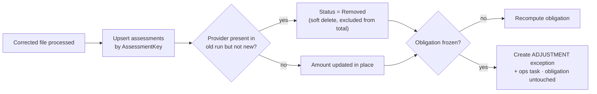

Soft-delete (status) rather than hard delete preserves the audit trail of what was once billed, which matters when a provider disputes an invoice.

### C.3.5 Bulk-safe DML

```apex
Database.UpsertResult[] results =
    Database.upsert(assessments, Dues_Assessment__c.Assessment_Key__c, false); // allOrNone = false
```
Partial success is deliberate: one malformed row must never fail the other 1,999 in the chunk. Each failure is captured with its row reference into the exception queue.

## C.4 Stage 4: Aggregation to the obligation

### C.4.1 Why not a roll-up summary field

A master-detail + roll-up summary is the "free" answer, and it is the **wrong** one here:

| Concern | Roll-up summary | Deterministic recompute **(chosen)** |
|---|---|---|
| Freeze after publication | ✗ Impossible: a late child edit silently changes an invoiced amount | ✓ `Is_Frozen__c` blocks recompute; changes route to adjustments |
| Auditability | ✗ No record of when/why the number changed | ✓ `Amount_Calculated_At__c` + `Calculation_Hash__c` + run log |
| Restartability | ✗ Opaque | ✓ Re-run any time, same result |
| Chicken/egg on insert | ✗ Parent must exist before children | ✓ Parent upserted by key in the same stage |
| Object-model cost | ✗ Consumes 1 of 2 master-detail slots; reparenting restrictions | ✓ Plain lookup |

For a **billing** number that people will pay and dispute, an amount that can change silently is a defect. Recompute wins.

### C.4.2 The batch, and why chunk boundaries are safe

```apex
global Database.QueryLocator start(Database.BatchableContext bc) {
    return Database.getQueryLocator([
        SELECT Id, Bill_To_Account__c, Amount__c, CurrencyIsoCode, Assessment_Key__c
        FROM Dues_Assessment__c
        WHERE Dues_Cycle__c = :cycleId
          AND Status__c = 'Valid'
        ORDER BY Bill_To_Account__c, CurrencyIsoCode
    ]);
}
```

Ordering by account keeps an account's assessments contiguous, but a chunk boundary can still split one account across two chunks. That is handled by **run-scoped additive accumulation**:

```
for each (account, currency) group in this chunk:
    obligation = upsert by ObligationKey
    if (obligation.Rollup_Run_Id__c != currentRunId):     // first touch this run
        obligation.Amount_Due__c      = chunkSum          // reset
        obligation.Provider_Count__c  = chunkCount
        obligation.Rollup_Run_Id__c   = currentRunId
    else:                                                 // continuation chunk
        obligation.Amount_Due__c     += chunkSum          // accumulate
        obligation.Provider_Count__c += chunkCount
```

Batch chunks for a given job execute **serially**, so accumulation is deterministic, and the run-id reset makes the whole job idempotent: re-running produces the same totals, never doubled ones. The final chunk stamps `Amount_Calculated_At__c` and `Calculation_Hash__c`.

> **Note for Batch Apex:** `start()` cannot return a `GROUP BY` aggregate as a `QueryLocator`. Hence the row-level locator plus in-chunk aggregation above. (An aggregate `Iterable` is an option only while the distinct-group count stays small; the pattern above has no such ceiling.)

**Scale-out beyond ~100K accounts:** switch to two-phase, write per-(run, account, chunk) partials to a lightweight object, then a second batch sums partials into obligations. Same keys, same invariants, unbounded scale. Not needed for MVP; documented so the ceiling is a known, planned step rather than a surprise.

### C.4.3 Single-provider accounts

PRD: organisations with one provider under a TIN are billed individually. That is simply an obligation with `Provider_Count__c = 1`, **no separate code path**. The distinction is presentational (whether the notice includes a roster attachment), driven by a CMDT threshold (`Attach_Roster_Above_Provider_Count__c`, default 1).

## C.5 Stage 5: Approval and freeze gate

No obligation is published until:

1. the file balances (control totals reconcile),
2. every exception has an ops disposition (corrected, excluded or accepted),
3. business approval is recorded on `Dues_Cycle__c` (`Approved_By__c`, `Approved_On__c`),
4. contributing assessments are locked (`Is_Locked__c = true`).

On approval: obligation `Lifecycle_Status__c = Approved`, `Is_Frozen__c = true`. **This gate is what makes the amount trustworthy**, after it, nothing changes the number except an explicit, audited adjustment.

Auto-approval is available per market (`Auto_Approve__c`) for markets where the business does not want a manual gate.

## C.6 Stage 6: Payment link generation at scale

### C.6.1 The problem with the out-of-the-box approach

Salesforce provides a **Generate Payment Link** flow action (Salesforce Payments), normally used from a record-triggered or screen flow. For 10,000+ obligations that pattern fails on three counts: one flow interview per record, one gateway callout per record with no batching or throttle, and no retry or dead-letter path when the provider API rate-limits or times out.

### C.6.2 Chosen approach: batch that calls the standard action

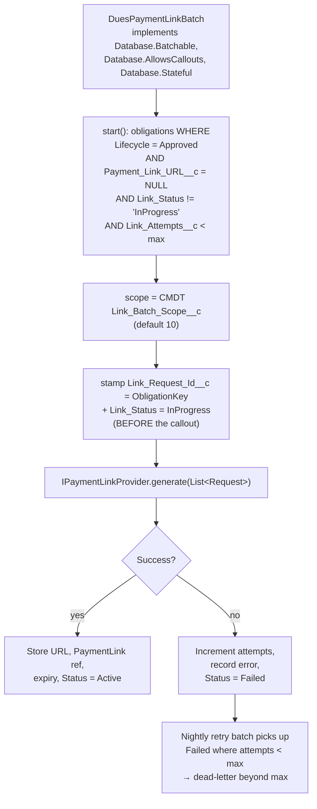

**Calling the managed action from Apex** uses the platform's `Invocable.Action` API (generally available), which lets Apex invoke a standard invocable action and read its results:

```apex
// Wrapped behind IPaymentLinkProvider so it is mockable in tests
Invocable.Action action = Invocable.Action.createStandardAction(CONFIG.Link_Action_Name__c);
action.setInvocationParameter('amount',            req.amount);
action.setInvocationParameter('currencyIsoCode',   req.currencyIsoCode);
action.setInvocationParameter('paymentMethodSetId',CONFIG.Payment_Method_Set_Id__c);
action.setInvocationParameter('accountId',         req.accountId);
List<Invocable.Action.Result> results = action.invoke();
```

> **Verify in the target org (§J):** the exact action API name and its parameter contract, and whether it accepts a list for bulk invocation. Both are org/release-specific. The `IPaymentLinkProvider` interface exists precisely so that this uncertainty is contained in **one class**. If the action turns out to be unsuitable, we swap the implementation (supported REST endpoint, or a gateway adapter) without touching the batch, the obligation model, the notification engine or the tests.

### C.6.3 Governor budget and throughput

| Limit | Value | Design response |
|---|---|---|
| Callouts per transaction | 100 | Scope 10-20 → 10-20 callouts per chunk |
| Cumulative callout time per transaction | 120 s | Scope 10 at ~2 s each ≈ 20 s |
| Concurrent batch jobs | 5 | Orchestrator chains stages; never fans out |
| Async executions / day | 250K (or 200 × licenses) | ~500-1,000 chunks per cycle: negligible |

**Throughput:** 10,000 obligations ÷ scope 10 = 1,000 chunks × ~3 s ≈ **50 minutes**, run overnight. Scope is CMDT-tunable, so it is dialled in during performance testing rather than redeployed.

### C.6.4 Idempotency and duplicate-link prevention

- `Link_Request_Id__c` is stamped **before** the callout. If the transaction dies after the gateway created the link but before Salesforce committed, the nightly reconciliation finds the orphan `PaymentLink` (by that request id / account + amount) and repairs the obligation instead of generating a second link.
- Only one link may be `Active` per obligation. Regeneration (after an approved adjustment) deactivates the previous link first, and the notice re-send always reads the link from the obligation, so an old email never points at a stale amount.

### C.6.5 One-time vs reusable link: a decision the PRD needs

PRD 4.1 says *"a unique, one-time-use payment URL for each invoice."* But the same link is emailed in up to five notices. **Interpretation adopted here:** the link is **unique per obligation per cycle** with a **predefined, locked amount**, and it is **deactivated on successful payment**: functionally one-time-*payment*, not one-time-*open*. Generating a fresh nonce per email would multiply link volume five-fold, break the reminder flow, and confuse a payer holding an earlier email. *Flag for business sign-off (§J, D-04).*

### C.6.6 Offline (check) payments

The PRD keeps accepting paper checks. A "Record Offline Payment" quick action on the obligation writes method = Check, reference, date and amount through the **same** `DuesSettlementService` used by card/ACH. This is essential: it means a check payment also cancels the remaining reminders, sends the receipt, and closes the assessments, one settlement path, not two.

## C.7 Stage 7-8: The notification engine

### C.7.1 Two calculation methods from one config table

| Method | Used by | Configuration |
|---|---|---|
| `FIXED_DATE` | Annual dues | Month/day per notice: invoice 12-15, reminder 1 on 01-02, reminder 2 on 01-23, due 01-30, final 02-06, termination review 02-14 |
| `RELATIVE_TO_INVOICE` | Monthly invoices | +15, +23, +30 (due), +37, +45 days |
| `RELATIVE_TO_DUE` | Available | −30/−15/−7, +7/+14 relative to due date |

All three resolve through one method, `DuesScheduleCalculator.resolve(cycle, scheduleRow)` → a Date. Adding a cadence is a CMDT row.

> **Discrepancy to resolve (§J, D-05):** the notification lifecycle diagram uses T−30 / T−15 / T−7 / due 01-01 / T+7 / T+14, while PRD 4.3 specifies invoice 12-15, reminders 01-02 and 01-23, due **01-30**, final 02-06, review 02-14. **The PRD dates are implemented**; the diagram should be updated. Because both are pure configuration, correcting this later costs one CMDT edit, but the templates and business communications should be built against the right dates from day one.

### C.7.2 Materialise, then dispatch (two steps, deliberately)

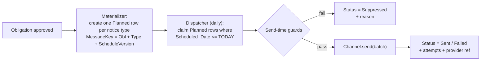

**Why separate:** the full communication plan is visible to operations the moment an obligation is approved ("what will this account receive, and when?"), notices can be cancelled *en masse* on payment before they are ever sent, and the send step becomes a small, restartable, throttleable job.

**Send-time guards (all re-checked immediately before sending):**
1. master kill switch off? → abort run
2. `Notifications_Enabled__c` and this notice type `Active__c`? → else Suppressed
3. obligation `Payment_Status__c` still unpaid? → else Suppressed (this is the PRD's "stop on payment", enforced twice: at settlement *and* at send)
4. obligation lifecycle in Approved/Published, not Cancelled
5. active payment link present and unexpired
6. recipient resolved and not bounce-flagged
7. daily send cap not exhausted → else defer to tomorrow (never silently drop)

`MessageKey` uniqueness means a double-run of the dispatcher cannot produce a second email. `Schedule_Version__c` increments if the business changes the calendar mid-cycle, which intentionally allows a corrected notice without breaking the uniqueness guarantee.

### C.7.3 Recipient resolution ladder (CMDT-ordered)

1. Account's designated **billing contact** (contact role / lookup)
2. Account primary contact email
3. Account-level billing email field
4. → `EXCEPTION: NO_RECIPIENT` (never send to a guessed address)

The **resolved address is snapshotted** on the communication row, so twelve months later the record still shows exactly where the notice went, even if the contact has since changed.

### C.7.4 Channel abstraction: the key to the 100K question

```apex
public interface IDuesNotificationChannel {
    List<DuesSendResult> send(List<DuesSendRequest> requests);   // bulk by contract
    Integer remainingCapacityToday();                            // throttle input
    Boolean supportsDeliveryEvents();                            // bounce handling
}
```

The implementation class is named in `Dues_Integration_Setting__mdt.Notification_Channel_Class__c` and instantiated by `Type.forName(...).newInstance()`. Moving from Salesforce email to Marketing Cloud Next is then a **metadata change**, with the dispatcher, guards, logging, retry and reporting untouched. This is the single most important design decision for the volume question in Part D.

### C.7.5 Newsletter attachment

PRD: the current annual newsletter PDF is attached to the initial notice. Implementation: a designated Library/folder holds the current `ContentVersion`; `Dues_Integration_Setting__mdt.Newsletter_Content_Doc_Id__c` (or a "current newsletter" flag on a small config record business can update) points at it. Business uploads a new PDF and updates one field, no deployment. Note the attachment inflates every send; if the PDF is large, prefer a hosted link (also better for deliverability), recommended, subject to business preference.

## C.8 Payment settlement

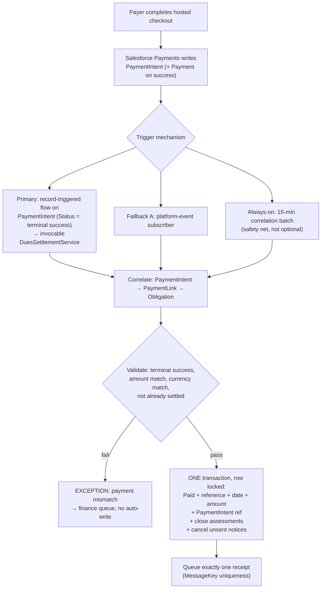

**The user's stated requirement, "when the Payment Intent record is updated, tag that Payment Intent to the dues obligation, and we can do this with Flow", is implemented as the primary path (D).** Two caveats drive the fallbacks:

- **Verify** that `PaymentIntent` supports record-triggered flows/Apex triggers in this org and release (§J, V-03). Some managed/standard payment objects do not.
- Even if it does, event-driven settlement can miss (flow errors, mixed-DML, deployment window). The **15-minute correlation batch is always on**. It is the difference between "payment status is usually right" and PRD KR-2's "100% data accuracy."

**Concurrency:** settlement re-queries the obligation `FOR UPDATE` inside the transaction. Two concurrent events for the same obligation serialise; the second sees `Payment_Status__c = Paid` and no-ops. Combined with receipt `MessageKey` uniqueness, a duplicate event **cannot** produce a duplicate state transition or a duplicate receipt.

**Partial payment** (amount < amount due): never auto-mark Paid. Status → `Partially Paid`, exception to finance, reminders continue by default (CMDT-switchable per market).

## C.9 Nightly reconciliation

The safety net that turns "eventually consistent" into "provably correct". Compares:

| Check | Repair (safe) | Exception (unsafe) |
|---|---|---|
| Approved obligation with no active link | Re-queue link generation | Beyond retry limit → dead letter |
| `PaymentLink` exists with no obligation reference | Re-link by request id | Ambiguous → exception |
| Succeeded `PaymentIntent` with obligation still Unpaid | Run settlement | Amount mismatch → finance exception |
| Obligation Paid but no receipt communication | Queue receipt | n/a |
| `Calculation_Hash__c` ≠ recomputed hash | n/a | Always exception (data changed outside the pipeline) |
| Communication stuck `In Progress` > N hours | Reset to Planned | Beyond attempts → dead letter |
| Bounced recipient (bounce management flag) | n/a | Task for manual follow-up (PRD 4.3) |

Every exception carries the record, the stage, the reason code and a suggested action, and appears on the operations dashboard.

## C.10 Retention and purge

Requirement: delete roster records after 1 year; delete provider dues records after 1 year; the obligation is the source of truth.

> **Conflict to resolve: PRD 4.2 requires payment and communication history retained ≥ 5 years, and group invoices are issued "with an attached roster."** If provider-level assessments are deleted at 12 months, the org can no longer reproduce *which providers* a 3-year-old invoice covered, which is exactly the evidence needed in a billing dispute or audit.

**Resolution: archive, then purge**

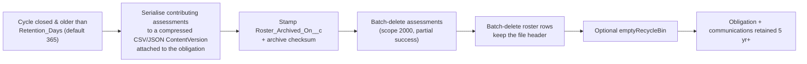

**Purge guards (all mandatory):**
- `Purge_Enabled__c` must be true (default **false**; purge is opt-in, and destructive jobs should never be on by default)
- cycle `Status = Closed` **and** due date older than the retention window
- never delete anything attached to an obligation that is Unpaid, Partially Paid or in dispute
- `Dry_Run__c` mode reports the counts it *would* delete, for one full cycle of review before the first live purge
- every purge run writes a run log with counts and the archive references

Storage note: `Dues_Roster_Row__c` at ~200K rows/yr × 2 KB ≈ 400 MB, material against Salesforce data storage, which is precisely why the 1-year purge is right. The archive files live in Content (file storage, far cheaper) and preserve the audit trail.

## C.11 Adjustments after publication

PRD: *"Invoices may need to be modified if providers leave after invoices are issued."*

| Scenario | Handling |
|---|---|
| Provider leaves before notice sent | Assessment → Removed; obligation recomputed (not yet frozen) |
| Provider leaves after notice sent, before payment | `Dues_Adjustment__c` (or an adjustment reason + audit stamp on the obligation) → approved by ops → obligation amount updated, **previous link deactivated, new link generated**, revised notice sent |
| Provider leaves after payment | No refund (PRD). Credit noted for the next cycle; flagged on the account |
| Provider added mid-cycle | New assessment; if the obligation is frozen, either a supplemental obligation or an adjustment, **per market CMDT** (`Mid_Cycle_Addition_Mode__c`) |

Every adjustment is audited (who, when, why, old/new amount). The amount on a published obligation is never edited silently, that is the whole point of the freeze.

## C.12 Error handling, restart and observability

| Layer | Mechanism |
|---|---|
| Run telemetry | `Dues_Run_Log__c`: run id, stage, market, cycle, status, records in/out/exception, start/end, last processed id |
| Restart | Each stage is keyed and idempotent → "Restart from stage N" re-enqueues safely; nothing is double-applied |
| Partial failure | `Database.*(..., allOrNone=false)` everywhere; per-row errors captured with the source row reference |
| Retry | Attempt counters on links and communications; retries stop at the CMDT limit and dead-letter |
| Alerting | Run log failure or exception count over threshold → ops task/notification (channel-agnostic) |
| Dashboard | Stage counts, exception queue depth, link generation success rate, send success rate, unreconciled payments |
| Debugging | Every log line carries the run id, so one cycle's execution is traceable end to end |

## C.13 Bulkification standards (non-negotiable)

1. **No SOQL, DML or callout inside any loop.** Reviewed at PR time; enforced by static analysis in CI.
2. **Every service method takes a collection**: `List<>`/`Map<>` in, results out. No single-record public entry points except a thin wrapper for LWC/quick actions that delegates to the bulk method.
3. **One trigger per object**, handler pattern, with a `Trigger_Setting__mdt.Bypass__c` switch so data loads and migrations can turn triggers off without a deployment.
4. **Staging object stays trigger-free** (§C.1.1).
5. **Selective queries.** Filter on indexed fields: External Ids, lookups (`Roster_File__c`, `Dues_Cycle__c`), `CreatedDate`. Avoid `!=`, leading wildcards and formula-field filters on large objects. Request custom indexes on `Status__c` and `Market_Code__c` if selectivity testing shows the need.
6. **Scopes are configuration**, not constants: 2,000 for pure DML stages, 200 for resolution-heavy stages, 10-20 for callout stages.
7. **`Database.Stateful` only for counters**, never for record collections (heap).
8. **Aggregate in chunks**, never assemble an org-wide map in memory.
9. **Bulk API 2.0** for the inbound load; no synchronous API row-by-row insert.
10. **Volume tests at 10× expected**: 200 and 2,000-record chunks in unit tests, 100K-row load in full sandbox before go-live.

**Limit budget for a 10K-provider / 3K-account cycle:**

| Stage | Chunks | Queries/chunk | DML/chunk | Callouts | Est. duration |
|---|---|---|---|---|---|
| Ingest | 5 @ 2,000 | ~4 | 1 | 0 | < 2 min |
| Resolve | 50 @ 200 | ~6 | 1 | 0 | ~5 min |
| Assess | 5 @ 2,000 | ~3 | 1 | 0 | < 2 min |
| Aggregate | 5 @ 2,000 | ~3 | 2 | 0 | < 2 min |
| Links | 1,000 @ 10 | ~2 | 1 | 10 | ~50 min |
| Materialise | 3 @ 2,000 | ~3 | 1 | 0 | < 1 min |
| Dispatch | throttled | ~4 | 2 | 0/1 | capped by channel |

All well inside platform limits, with the link stage as the long pole, which is why it runs overnight and days ahead of the first notice date.

## C.14 Security and compliance

- **PCI:** no PAN, CVV, expiry or bank account number in any custom field, debug log or exception message. Settlement code allow-lists the fields it copies from the payment objects, it never serialises the whole record into a log.
- **Payment link URL is a bearer secret.** `Payment_Link_URL__c` is FLS-restricted to the dues operations permission set, excluded from broadly shared report types and from the guest user profile.
- **Guest/site access:** the Pay Now Experience site is the managed data channel. Custom dues objects are **not** exposed to the guest profile.
- **Least privilege:** permission sets, `Dues_Operations` (business ops), `Dues_Finance` (settlement exceptions), `Dues_Admin` (CMDT edit), `Dues_Integration` (the automation user). No profile-level grants.
- **Named Credentials** for any external channel; no endpoints or keys in code or CMDT text fields.
- **Auditability:** field history on obligation amount, status and payment fields; Setup Audit Trail covers CMDT flag changes; 5-year retention on obligations and communications.

---

# PART D: EMAIL VOLUME: THE ANSWER

## D.1 What Salesforce actually allows (the numbers)

| Limit | Value | Applies to |
|---|---|---|
| **Daily external email recipients, org-wide** | **5,000 per day** (GMT reset) | The whole org, shared by every feature |
| Scope of that cap (orgs created **Spring '19 or later**) | Apex `Messaging.sendEmail`, **email alerts**, **Send Email flow action**, simple email action, REST API | i.e. essentially everything |
| Emails to **internal users** via `setTargetObjectId` | **Exempt** | Internal notifications are free |
| Emails to **contacts / leads / person accounts** | **Count as external** | Our providers, these count |
| Email alerts (older orgs) | 1,000 per standard licence/day, org max 2,000,000 | Only relevant for pre-Spring-'19 orgs |
| Apex per transaction | **10** `sendEmail()` invocations | Batch design constraint |
| List email (UI) | 500 recipients via list-view select-all; 200 manually selected | Not a viable bulk channel |

**Three consequences that must shape the build:**

1. **The 5,000 is the entire org's budget, not ours.** Case emails, approval notifications, other teams' flows and any Apex email all draw from the same pool. A dues blast that consumes 4,800 recipients can break unrelated business processes for the rest of that GMT day.
2. **Over-cap sends fail rather than queue.** There is no built-in retry. If we do not throttle, we lose notices and never learn which ones.
3. **Email alerts do not get us around it** in a modern org, the same 5,000 cap covers them. Neither does Email Relay: it changes the *route* (through the corporate MTA), not the *allocation*.

## D.2 Applied to this programme

| Scenario | Send units | Verdict |
|---|---|---|
| **Today**: Texas CIN, ~10K providers, billed at account level (est. 2,000-4,000 bill-to accounts) | 2,000-4,000 per notice event | **Fits in one day, but consumes 40-80% of the org's entire daily email budget.** Must be throttled and spread. |
| **Peak day**: initial notice + a monthly cycle + normal org traffic | Could exceed 5,000 | **Would fail without throttling** |
| **Future: 100,000 accounts** | 100,000 per notice event | **Impossible on core Salesforce.** 100,000 ÷ 5,000/day = **20 days per notice event**. With five notices per cycle, a single cycle would need 100 days of sending. **Core email cannot serve this requirement at any configuration.** |

## D.3 What we do in MVP (buildable now, within the time constraint)

1. **Throttle by configuration.** `Daily_Email_Cap__c` (recommended start: **1,500/day**) leaves the rest of the org's budget intact.
2. **Spread the initial notice** across a configurable window (`Send_Window_Days__c`, e.g. 3 days). The dispatcher takes the oldest scheduled notices first; the remainder rolls to tomorrow with status `Deferred`, visible, never dropped.
3. **Check remaining capacity before sending.** `Messaging.reserveSingleEmailCapacity(n)` reserves headroom for the transaction and fails fast; a lightweight `/services/data/vXX.X/limits` read (`SingleEmail`) via named credential gives the dispatcher an accurate remaining figure at run start.
4. **Never send more than 10 `sendEmail()` invocations per transaction**; batch recipients within each invocation.
5. **Send times off-peak** (early GMT) so a partial failure still leaves the same GMT day to recover.
6. **Bounce handling:** enable Bounce Management; a nightly job flags bounced contacts, suppresses further sends to that address, and raises the manual-follow-up task the PRD requires. (Native bounce data is coarse, one more reason the future channel matters.)

**Result:** MVP works, is safe for the rest of the org, and is honest about its ceiling.

## D.4 What we design for now and switch on later

`IDuesNotificationChannel` (§C.7.4) means the volume decision is deferred without being ignored.

| Option | Capacity | Effort | Cost | Bounce/delivery events | Verdict |
|---|---|---|---|---|---|
| **Salesforce email (MVP)** | ≤ 5,000/day org-wide | Built in this project | $0 | Coarse (bounce flag) | **Build now** |
| **Marketing Cloud Next** (Growth/Advanced), native on core + Data Cloud; dedicated IPs available since Feb 2026 | High volume | Moderate, the architecture already anticipates it | ~$1,500 (Growth) / ~$3,250 (Advanced) per org/month list | Full | **Recommended target state**; matches the architecture diagram |
| **Marketing Cloud Engagement** (transactional messaging API) | Very high | Higher (separate stack, integration) | Licence | Full | Choose if the org already owns Engagement |
| **External ESP** (SendGrid / SES / Mailgun) via named-credential callout, **callouts do not consume Salesforce email limits** | Very high | Low-moderate | Low (usage-based) | Full webhooks (best bounce handling) | **Best value fallback** if Marketing Cloud is not funded |
| Account Engagement (Pardot) | Tiered, B2B marketing | Moderate | Licence | Partial | Not suited to transactional receipts |
| Email Relay | **Does not raise the limit** | Low | $0 | No | ✗ Not a solution to volume |

**Recommendation:** build MVP on Salesforce email behind the channel interface; plan Marketing Cloud Next for the volume phase; keep the external-ESP adapter as the fast, low-cost fallback if Marketing Cloud funding slips. In all three cases the dispatcher, guards, throttle, logging, retry and reporting are the same code.

**Direct answer to "can Salesforce accept 100K email notifications?"**: **No.** Not with email alerts, not with Apex, not with Email Relay, not with a limit-increase request. The 5,000/day org cap is architectural. Plan the channel migration before the second market goes live, and note that the ~10K case works today only because we throttle it.

---

# PART E: SALESFORCE PAYMENTS / PAY NOW: REVIEW AND ALTERNATIVES

## E.1 What Pay Now gives us

| Capability | Assessment |
|---|---|
| Hosted checkout page (Experience Cloud) | ✓ Removes Salesforce from PCI scope for card data, the single biggest compliance win |
| Payment link with predefined amount, shareable by email | ✓ Exactly the model this programme needs |
| Guest checkout (no login) | ✓ Critical: providers will not create portal accounts to pay dues |
| Standard objects: `PaymentLink`, `PaymentIntent`, `Payment`, `PaymentMethod`, `PaymentGateway` | ✓ Native reporting and correlation; API 58.0+ |
| Flow action to generate links | ✓ Exists, but is record-at-a-time (see §C.6) |
| Tokenisation | ✓ Only tokens/references are stored in Salesforce |
| Card + digital wallets | ✓ |
| ACH | ⚠ Provider-dependent (US-based merchant required with Stripe). **Verify before commitment: the PRD requires ACH.** |
| Bulk link generation | ⚠ Not offered as a bulk API; hence the batch design |
| Prerequisite | ⚠ Experience Cloud site as the payments data channel must be configured |

## E.2 Alternatives considered

| Option | Pros | Cons | Verdict |
|---|---|---|---|
| **Pay Now + batch link generation** | Native, PCI-light, already the selected solution, no new licence | Bulk generation is our code; ACH depends on provider | **✓ Chosen** |
| Pay Now + record-triggered flow only | Zero code | Fails at 10K scale; no retry, throttle or dead-letter | ✗ For bulk. Keep for the manual one-off link button |
| Third-party gateway app (Chargent, ebizCharge, etc.) | Mature dunning, ACH, surcharging | New licence, new PCI review, reverses an approved decision | Fallback only if Pay Now cannot do ACH |
| Direct gateway integration (custom Stripe) | Maximum control | Highest build + PCI burden; duplicates a licensed product | ✗ |
| Invoice-only (status quo + links) | Minimal build | Does not solve collections, the actual problem | ✗ |

## E.3 Verification items before build starts

See §J (V-01 … V-06). The two that can change the design are **ACH availability** and **whether `PaymentIntent` supports record-triggered automation**. Both have designed fallbacks, so neither blocks the start of work, but both should be answered in week 1.

---

# PART F: ADDING A NEW MARKET (the framework proof)

**Scenario:** Market #2, monthly invoices, $250 per provider, one TIN priced at $195 by contract, different reminder cadence, notifications initially off while data is validated.

| # | Change | Type | Who | Time |
|---|---|---|---|---|
| 1 | `Dues_Market__mdt`: new row with code, eligible Account record types, currency, billing level, precedence, duplicate strategy | Config | Admin | 15 min |
| 2 | `Dues_Rate__mdt`: default 250.00 + one TIN-override row at 195.00 | Config | Admin | 10 min |
| 3 | `Dues_Notification_Schedule__mdt`: 5 rows, method `RELATIVE_TO_INVOICE`, offsets +15/+23/+30/+37/+45 | Config | Admin | 20 min |
| 4 | `Dues_Feature_Flag__mdt`: new market row, `Notifications_Enabled__c = false` initially | Config | Admin | 5 min |
| 5 | `Dues_Cycle__c`: cycle record(s) for the period | **Data** | Business | 5 min |
| 6 | Email templates for the new market | Config | Marketing | varies |
| 7 | `Dues_Integration_Setting__mdt`: payment method set, channel | Config | Admin | 10 min |
| 8 | `Dues_Source_Mapping__mdt` **only if** the roster feed has a different shape | Config | Admin | 15 min |
| **9** | **Apex / Flow / object changes** | n/a | n/a | **None** |

Then flip `Notifications_Enabled__c` to true when validated. **That is the test of whether this is a framework**, and the design above is built to pass it.

**What would still require code** (be honest about the boundary): a genuinely new *concept*, e.g. instalment plans, proration arithmetic, a new payment channel, or a billing level that is neither account nor provider. Those are new capabilities, not new markets. The design isolates them (rate strategy, aggregation strategy and channel are all interface-based), so even these are additive rather than invasive.

---

# PART G: REPORTING

## G.1 MVP reports (required at launch)

| Report | Built on | Notes |
|---|---|---|
| A/R Aging | `Dues_Obligation__c` | Buckets from `Days_Overdue__c` formula (0-30/31-60/61-90/90+) |
| Paid Provider Dues | Obligation + Assessment | Group by market, cycle, account |
| Unpaid Provider Dues | Obligation | `Payment_Status__c = Unpaid` |
| Overdue Provider Dues | Obligation | Unpaid **and** past due date |
| **New Provider Dues Gap** | Generated | See below |

**The gap report needs a design note.** "Providers in Health Cloud with no dues assessment for the current cycle" is a *does-not-exist* query, Salesforce reports handle cross-object absence poorly at scale. **Recommendation:** a nightly `DuesGapDetectionBatch` writes `Dues_Gap__c` records (provider, account, cycle, detected date, status), and the report runs on that object. This also gives a working queue with an assignment and a resolution state, which a "report of absences" cannot, and it is what actually triggers the manual dues-assignment task the PRD describes.

## G.2 Post-launch reports
Provider group invoice status; dues by TIN/NPI; annual collection summary; manual intervention / termination review.

## G.3 Dashboard
Total assessed · total collected · outstanding balance · collection rate · unpaid provider count · overdue account count · records needing manual intervention · status by account · status by NPI · aging by days overdue · **plus operational tiles:** exception queue depth, link generation success rate, notices sent/failed/deferred today, unreconciled payments.

---

# PART H: TEST STRATEGY

| Level | Coverage |
|---|---|
| **Unit** | Every service with bulk fixtures (200 and 2,000 records). Dedup matrix: identical duplicates, conflicting amounts, same NPI under two TINs, unmatched NPI, unmatched TIN, ambiguous account. Schedule calculator: fixed vs relative, leap year, month-end, weekend behaviour. |
| **Idempotency** | Run every stage twice; assert byte-identical results and no duplicate assessments, obligations, links or communications. **This is the single most valuable test in the suite.** |
| **Accuracy** | 12 providers → one obligation at exactly 12 × rate; rounding to the cent; `Calculation_Hash__c` verification; sum of assessments = obligation, always. |
| **Concurrency** | Two settlement events for one obligation → one state transition, one receipt. |
| **Mocking** | `IPaymentLinkProvider` and `IDuesNotificationChannel` have mock implementations. **Tests never call the real gateway and never send real email**: this is why both are interfaces. |
| **Volume** | Full-copy sandbox: 100K roster rows loaded via Bulk API, full pipeline timed, limits captured against the §C.13 budget. |
| **Negative** | Partial file, control-total mismatch, malformed rows, gateway timeout, over-cap email, frozen-obligation change attempt, purge with an unpaid obligation. |
| **UAT** | Production-like data (PRD open item), all five notice types, card + ACH + check, adjustment path, exception queue workflow. |
| **Regression** | Idempotency + accuracy suites run on every deployment. |

---

# PART I: DELIVERY PLAN

| Phase | Scope | Exit criteria |
|---|---|---|
| **0: Verify** (week 1, parallel) | §J verification items: Pay Now action contract, ACH, PaymentIntent automation, org email limit regime, roster file id + completion signal | All answered; design deltas absorbed |
| **1: Foundation** | Objects, keys, CMDT layer, permission sets, run log, orchestrator skeleton, trigger framework | A configured market exists with zero functional code paths hard-coded |
| **2: Roster → obligation** | Ingest, latest-file selection, resolution, dedup, aggregation, approval gate, exception queue | 100K-row load produces provably accurate obligations; idempotency suite green |
| **3: Links** | `IPaymentLinkProvider`, batch, retry, dead letter, manual link action, offline payment action | 10K links generated within the overnight window; duplicate-link test green |
| **4: Notifications** | Schedule calculator, materializer, dispatcher, guards, throttle, templates, newsletter, feature flags | All five notice types on the PRD calendar; kill switch verified in a sandbox "production" drill |
| **5: Settlement** | Flow/event/batch correlation, settlement service, receipts, reconciliation | Card, ACH and check all settle; duplicate-event test green |
| **6: Reporting & retention** | MVP reports, dashboard, gap detection, archive+purge (dry-run first) | Reports signed off; purge dry-run reviewed for one full cycle before enabling |
| **7: Hardening** | Volume test, security review, runbook, ops training | Go-live readiness |

**Critical path:** Phase 0 → 2 → 3. Notifications (4) can be built in parallel with 3 because they are separated by the channel interface.

---

# PART J: OPEN QUESTIONS AND VERIFICATION CHECKLIST

## J.1 Must verify in the target org (week 1)

| # | Item | Why it matters | If the answer is unfavourable |
|---|---|---|---|
| V-01 | Exact API name and parameter contract of the standard **Generate Payment Link** action, and whether it accepts a list | Determines the link batch implementation | Swap `IPaymentLinkProvider` for a supported REST or gateway adapter, one class |
| V-02 | **ACH** availability on the configured payment provider (PRD requires it) | PRD functional requirement | Card + check at launch; ACH in phase 2, or reconsider gateway |
| V-03 | Does **`PaymentIntent`** support record-triggered flows / Apex triggers? | The user's preferred settlement mechanism | Platform-event subscriber; the 15-min correlation batch runs regardless |
| V-04 | Org **created before or after Spring '19**? Read `/services/data/vXX.X/limits` → `SingleEmail`, `MassEmail`, `DailyWorkflowEmails` | Decides whether email alerts share the 5,000 cap, and shows current headroom | Sets the throttle values in Part D |
| V-05 | Can the upstream team supply a **file/batch id** and a **completion signal**? | Latest-file selection correctness | Quiet-period fallback only, a documented, accepted risk |
| V-06 | Can `Dues_Obligation__c` hold a **lookup to `PaymentLink`/`PaymentIntent`**? | Reporting convenience | Store the reference as an indexed External Id text field |
| V-07 | UAT environment has production-like data (PRD open item) | Volume and resolution testing | Generate synthetic data at 10× volume |

## J.2 Business decisions required

| # | Decision | Recommendation |
|---|---|---|
| D-01 | Object naming: `Annual_Account_Dues__c` vs `Dues_Obligation__c` | **Rename now**: monthly invoices are already in the PRD; API renames later are expensive |
| D-02 | Assessment retention: 1 year (stated) vs 5 years (PRD 4.2) | **Archive then purge** (§C.10), satisfies both |
| D-03 | Reminder calendar: PRD dates vs the lifecycle diagram's T−30/−15/−7 | **Implement the PRD dates**; update the diagram |
| D-04 | "One-time-use" link vs one active link per obligation | **One active link per obligation**, deactivated on payment (§C.6.5) |
| D-05 | Newsletter as PDF attachment vs hosted link | **Hosted link** for deliverability; attachment if business insists |
| D-06 | Partial payment handling | Never auto-close; finance exception; reminders continue (per-market switch) |
| D-07 | Mid-cycle provider additions on a frozen obligation | Supplemental obligation (default) vs adjustment, per market |
| D-08 | Notification channel funding for the volume phase | Marketing Cloud Next; external-ESP adapter as the costed fallback |
| D-09 | KR-1 baseline: "Time to Payment" from x to y days | Still unfilled in the PRD; needed to measure success. Instrument `Paid_Date__c − Invoice_Date__c` from day one so the baseline exists by cycle two |

## J.3 Gaps found between the PRD and the current diagrams

Raised so nothing is discovered late in build:

1. **Monthly invoices** (PRD 4.3, 7) appear in no diagram, the design above covers them via the schedule calculation method and the naming decision D-01.
2. **Paper checks** remain accepted (PRD 4.1) but no diagram shows an offline payment path; see §C.6.6.
3. **Newsletter PDF attachment** (PRD 4.3) is absent from the diagrams; see §C.7.5.
4. **Bounce handling** (PRD 4.3) is absent; see §C.9 and §D.3.
5. **Termination review task** for named owners (PRD 4.3) is shown only as a report; it should be an assigned Task.
6. **Reporting layer** (PRD 4.4) is absent from the architecture diagram; see Part G, including the gap-report design note.
7. **Reminder dates** differ between PRD and the lifecycle diagram; see D-03.
8. **Data retention conflict**; see D-02.
9. **ACH** is required by the PRD but not evidenced in the payment diagrams; see V-02.

---

## Appendix A: PRD traceability

| PRD | Requirement | Where satisfied |
|---|---|---|
| 4.1 | Secure payment URL per invoice | §C.6, D-04 |
| 4.1 | PCI tokenisation, no card data stored | Part E, §C.14 |
| 4.1 | Cards, ACH, checks | Part E, V-02, §C.6.6 |
| 4.2 | Pull provider name, id, email, amount from Health Cloud | §C.2 |
| 4.2 | Real-time status → Paid | §C.8 |
| 4.2 | Transaction id + timestamp logged | §B.2.4, §C.8 |
| 4.2 | 5-year retention | §C.10, D-02 |
| 4.3 | Initial notice 30 days prior + newsletter | §C.7.1, §C.7.5 |
| 4.3 | Dunning schedule (annual + monthly) | §C.7.1 |
| 4.3 | Stop on payment | §C.7.2 guard 3, §C.8 |
| 4.3 | Receipt on payment | §C.8 |
| 4.3 | Bounce handling | §C.9, §D.3 |
| 4.3 | Manual intervention task | §C.9, Part G |
| 4.4 | MVP reports + dashboard | Part G |
| 5 | Business rules (basis, billing level, amount, cycle, dates, variation, batch upload, adjustments, escalation, termination, retention, refunds) | Parts B, C, F |
| 6 | User workflow steps 1-10 | Part A, Part C |
| 7 | Pay Now, configuration/development items, two reminder methods, PCI constraints, discovery decisions | Parts C, E, J |

## Appendix B: Naming map (this document ↔ diagrams)

| This document | Diagrams |
|---|---|
| `Dues_Obligation__c` | `Annual_Account_Dues__c` |
| `Dues_Assessment__c` | `Provider_Dues_Assessment__c` |
| `Dues_Roster_File__c` + `Dues_Roster_Row__c` | `Roster_Import__c` (split into header + rows) |
| `Dues_Cycle__c` | `Billing_Program_Cycle__c` |
| `Dues_Communication__c` | `Dues_Communication__c` |
| `Dues_Market__mdt` | `Dues_Program__mdt` |
| ObligationKey / AssessmentKey / RowKey / MessageKey | Same concepts, same purpose |

## Appendix C: Sources consulted

Salesforce email limits: [Single Email Daily Limits for Emails Sent Using Apex and APIs](https://help.salesforce.com/s/articleView?id=000384947&language=en_US&type=1) · [Overview of Salesforce Email Limit Types](https://help.salesforce.com/s/articleView?id=000386730&language=en_US&type=1) · [Daily Allocations for Email Alerts](https://help.salesforce.com/s/articleView?id=workflow_limits_email.htm&language=en_US&type=5) · [Expanded Enforcement of Daily External Email Limit](https://help.salesforce.com/s/articleView?id=release-notes.rn_sales_productivity_email_expanded_email_limit.htm&language=en_US&release=218&type=5) · [Platform email limits (Limits Quick Reference)](https://developer.salesforce.com/docs/atlas.en-us.salesforce_app_limits_cheatsheet.meta/salesforce_app_limits_cheatsheet/salesforce_app_limits_platform_email.htm)

Salesforce Payments / Pay Now: [PaymentLink object](https://developer.salesforce.com/docs/atlas.en-us.object_reference.meta/object_reference/sforce_api_objects_paymentlink.htm) · [PaymentIntent object](https://developer.salesforce.com/docs/atlas.en-us.object_reference.meta/object_reference/sforce_api_objects_paymentintent.htm) · [Automate Payment Link Creation Using Flow Builder](https://help.salesforce.com/s/articleView?id=release-notes.rn_payments_payment_link_flow.htm&language=en_US&release=248&type=5) · [Add a Payment Link to a Salesforce Record](https://help.salesforce.com/s/articleView?id=commerce.pay_now_app_integration.htm&language=en_US&type=5) · [Set Up a Channel for Payment Data](https://help.salesforce.com/s/articleView?id=commerce.payments_data_channel_setup.htm&language=en_US&type=5) · [Optimize Payments with Salesforce Pay Now (Trailhead)](https://trailhead.salesforce.com/content/learn/modules/salesforce-pay-now-quick-look/get-to-know-salesforce-pay-now)

Apex: [Call Invocable Actions from Apex (GA)](https://help.salesforce.com/s/articleView?id=release-notes.rn_apex_invocableaction_class.htm&language=en_US&release=240&type=5) · [Messaging class](https://developer.salesforce.com/docs/atlas.en-us.apexref.meta/apexref/apex_classes_email_outbound_messaging.htm)

Health Cloud: [HealthcareProviderNpi](https://developer.salesforce.com/docs/atlas.en-us.health_cloud_object_reference.meta/health_cloud_object_reference/sforce_api_objects_healthcareprovidernpi.htm) · [Provider data model](https://developer.salesforce.com/docs/atlas.en-us.health_cloud_object_reference.meta/health_cloud_object_reference/hc_provider_data_model_overview.htm)

Marketing Cloud Next: [Marketing Cloud Next editions](https://www.concret.io/blog/marketing-cloud-next-growth-and-advanced-editions) · [Email limits and guidelines](https://help.salesforce.com/s/articleView?language=en_US&id=mktg.mc_overview_limits_email.htm&type=5)

> Figures were gathered from Salesforce documentation in September 2026. Salesforce limits change by release and edition: **confirm the live values in the target org** (§J, V-04) before finalising the throttle configuration.
